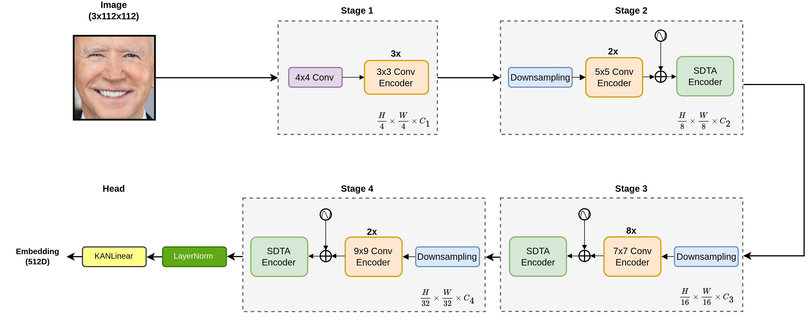

# Kolmogorov-Arnold Network Face Recognition (KANFace)
## 📝 Introduction
This project is inspired by using Kolmogorov-Arnold Network (KAN) for face recognition. KANFace integrates KAN's innovative architecture to replace the conventional MLP-based classification heads in traditional face recognition models with adaptive, learnable B-spline activations.
###  Kolmogorov-Arnold Networks (KAN)
KANs represent a fundamentally different approach to neural networks. While traditional networks use fixed activation functions applied at nodes, KANs have learnable activation functions on edges. This dual approach offers:

- Strong mathematical foundations based on the Kolmogorov-Arnold representation theorem
- Potentially higher parameter efficiency
- Increased expressivity through learnable univariate functions

In KANs, each connection between neurons applies a learnable univariate function ϕ, represented using B-splines with controllable grid size. The output is computed as the sum of these function evaluations.

### Face Recognition with KANs
Face recognition requires learning discriminative facial features that are robust to variations in pose, lighting, and expression. KANs potentially offer advantages for this task:

- **Expressivity**: KANs can learn complex non-linear transformations suited for facial feature extraction
- **Efficiency**: Potentially better parameter efficiency compared to traditional CNNs
- **Adaptability**: Learnable activation functions can adapt to the specific patterns in facial data

## 👥 Authors
This repository was made by:
 - Hung Pham | hungpthe170707@fpt.edu.vn | [ORCID](https://orcid.org/0009-0004-6317-4996) | [LinkedIn](https://www.linkedin.com/in/hungpham3112/)
 - Bac Dao | bacdxhe170633@fpt.edu.vn | [ORCID](https://orcid.org/0009-0001-5975-7396)| [LinkedIn](https://www.linkedin.com/in/daobac03/)
 - Ngoc Tran | ngoctphe172221@fpt.edu.vn |[ORCID](https://orcid.org/0009-0000-8470-3843)| [LinkedIn](https://www.linkedin.com/in/phingoc/)
 - Thai Nguyen | thainqhe172794@fpt.edu.vn |[ORCID](https://orcid.org/0009-0007-9340-9081) | [LinkedIn](https://www.linkedin.com/in/thainguyenvi/)
### Credit
- The original implementation of KAN is available [here](https://github.com/KindXiaoming/pykan). 
- The original paper of the KAN is available [here](https://arxiv.org/pdf/2404.19756).
- The EdgeFace repo is available [here](https://github.com/otroshi/edgeface).
- The ConvKAN repo is available [here](https://github.com/AntonioTepsich/Convolutional-KANs).

## 🏗️ KANFace Model
### Structure

<p align="center"><i>A schematic diagram of the KANFace face recognition model. The diagram is adapted from the EdgeFace architecture to illustrate the modifications made for face recognition. Specifically, the original MLP-based head is replaced with a KANLinear head that leverages learnable B-spline functions for enhanced non-linear approximation and robust embedding generation.</i></p>

### Benchmarks

KANFace evaluates on standard face recognition benchmarks:

- LFW (Labeled Faces in the Wild)
- CFP-FP (Celebrities in Frontal-Profile)
- AgeDB-30
- CALFW (Cross-Age LFW)
- CPLFW (Cross-Pose LFW)
- CFP-FF (Celebrities in Frontal-Frontal)

### Results
#### Benchmark Results of KANFace vs. Other FR Models
| **Model** | **#Params (M)** | **FLOPs (M)** | **LFW (%)** | **CA-LFW (%)** | **CP-LFW (%)** | **CFP-FP (%)** | **CFP-FF (%)** | **AgeDB_30 (%)** | **IJB-B (%)** | **IJB-C (%)** |
|-----------|-----------------|---------------|-------------|----------------|----------------|----------------|----------------|------------------|---------------|---------------|
| EfficientNet | 6.58 | 1140 | 99.53 | 95.78 | 90.92 | 96.32 | 99.5 | - | - | - |
| MobileFaceNetV1 | 3.4 | 1100 | 99.4 | 94.47 | 87.17 | 95.8 | 99.5 | 96.4 | 92 | 93.9 |
| ShuffleFaceNet 2x | 4.5 | 1050 | 99.62 | - | - | 97.56 | - | 97.28 | - | - |
| VarGFaceNet | 5 | 1022 | 99.85 | 95.15 | 88.55 | 98.5 | 99.5 | 98.15 | 92.9 | 94.7 |
| MobileFaceNet | 2 | 933.3 | 99.7 | 95.2 | 89.22 | 96.9 | 99.6 | 97.6 | 92.8 | 94.7 |
| SwiftFaceFormer-L1 | 11.8 | 804.6 | 99.68 | 95.80 | 90.10 | 96.61 | - | 96.95 | 91.81 | 93.82 |
| ProxylessFaceNAS | 3.2 | 900 | 99.2 | 92.55 | 84.17 | 94.7 | 98.8 | 94.4 | 87.1 | 89.7 |
| SqueezeFaceNet | 1.024 | 663 | 99.47 | 94.45 | 87.62 | 93.63 | 99.47 | 95.2 | 86.79 | 89.57 |
| ShuffleFaceNet 1.5x | 2.6 | 577.5 | 99.67 | 95.05 | 88.5 | 97.26 | - | 97.32 | 92.3 | 94.3 |
| ELANet | 1.61 | 550 | 99.68 | 96.07 | 92.17 | 97.16 | 99.76 | - | 92.7 | 94.4 |
| ConvFaceNeXt | 1.05 | 410.59 | 99.05 | 93.42 | 85.58 | 88.21 | 99.07 | 93.15 | 84.21 | 80.61 |
| SwiftFaceFormer-XS | 3.4 | 293.7 | 99.60 | 95.35 | 88.65 | 95.47 | - | 96.35 | 90.20 | 92.32 |
| GhostFaceNetsV2-1 (MS1MV3) | 6.88 | 272.105 | **99.8667** | **96.1167** | **94.65** | **99.33** | **99.9143** | **98.62** | **96.48** | **97.75** |
| EfficientFaceNet | 3.987 | 90 | 99.5 | 94.81 | 88.17 | 94.19 | 99.41 | 95.15 | 89.81 | 92.03 |
| EdgeFace - S (γ = 0.5) (**Baseline**) | 3.65 | 306.11 | 99.78 | 95.71 | **92.56** | 95.81 | - | 96.93 | **93.58** | **95.63** |
| EdgeFace - XS (γ = 0.6) (**Baseline**) | 1.77 | 154 | 99.73 | 95.28 | 91.82 | 94.37 | - | 96 | 92.67 | 94.85 |
| KANFace (($\gamma$) = 0.5) (**Ours**) | 6.8 | 396.85 | **99.683** | **95.733** | **92.833** | **98.086** | **99.671** | **96.550** | **93.81** | **95.66** |
| KANFace (($\gamma$) = 0.6) (**Ours**) | 4.74 | 239.56 | 99.65 | 95.317 | 91.467 | 97.171 | 99.529 | 95.517 | 92.95 | 94.75 |

#### Performance Benchmark of KANFace Model

Performance benchmark of KANFace with varying rank ratio, loss functions, and grid sizes. For IJB-B and IJB-C datasets, values represent the true acceptance rate (TAR) at false acceptance rate (FAR) of 1e-4. Bold values indicate best performance for each rank-ratio.

##### **Rank-Ratio: 0.6 – Arcface**

| Grid size | Params (M) | FLOPs (M) | LFW (%) | CP-LFW (%) | CFP-FP (%) | CA-LFW (%) | CFP-FF (%) | AgeDB_30 (%) | IJB_B (%) | IJB_C (%) |
|-----------|------------|-----------|---------|------------|------------|------------|------------|--------------|-----------|-----------|
| 15        | **3.75**   | **211.06**| 99.567  | 90.850     | 97.000     | 94.883     | 99.443     | 95.167       | 91.55     | 93.72     |
| 20        | 4.25       | 225.31   | 99.633  | 90.783     | 97.057     | 95.200     | 99.443     | 95.267       | 92.54     | 94.65     |
| 25        | 4.74       | 239.56   | 99.650  | **91.467** | **97.171** | 95.317     | **99.529** | **95.517**   | **92.95** | 94.75     |
| 30        | 5.23       | 253.82   | 99.633  | 90.933     | 96.614     | 95.017     | 99.500     | 95.033       | 92.36     | 94.41     |

---

##### **Rank-Ratio: 0.6 – Cosface**

| Grid size | Params (M) | FLOPs (M) | LFW (%) | CP-LFW (%) | CFP-FP (%) | CA-LFW (%) | CFP-FF (%) | AgeDB_30 (%) | IJB_B (%) | IJB_C (%) |
|-----------|------------|-----------|---------|------------|------------|------------|------------|--------------|-----------|-----------|
| 15        | **3.75**   | **211.06**| 99.600  | 90.917     | 96.986     | **95.467** | 99.343     | 95.083       | 92.75     | **94.85** |
| 20        | 4.25       | 225.31   | 99.650  | 91.050     | 96.657     | 95.150     | 99.514     | 95.167       | 91.68     | 93.80     |
| 25        | 4.74       | 239.56   | **99.683**| 90.633    | 96.786     | 94.867     | 99.443     | 95.200       | 92.75     | 94.76     |
| 30        | 5.23       | 253.82   | 99.633  | 91.117     | 96.371     | 95.050     | 99.400     | 94.933       | 92.12     | 94.21     |

---

##### **Rank-Ratio: 0.5 – Arcface**

| Grid size | Params (M) | FLOPs (M) | LFW (%) | CP-LFW (%) | CFP-FP (%) | CA-LFW (%) | CFP-FF (%) | AgeDB_30 (%) | IJB_B (%) | IJB_C (%) |
|-----------|------------|-----------|---------|------------|------------|------------|------------|--------------|-----------|-----------|
| 15        | **6.8**    | **396.85**| 99.683  | **92.833** | **98.086** | **95.733** | **99.671** | **96.550**   | 93.81     | 95.66     |
| 20        | 7.58       | 419.42   | 99.650  | 92.350     | 98.029     | 95.700     | 99.657     | 96.533       | **94.32** | **96.09** |
| 25        | 8.35       | 441.99   | **99.717**| 92.483   | 97.714     | 95.633     | **99.671** | 96.483       | 94.04     | 95.82     |
| 30        | 9.13       | 464.56   | 99.683  | 92.283     | 97.814     | 95.583     | **99.671** | 96.400       | 94.27     | 95.92     |

## ✨ Features
- Implementation of various KAN architectures for face recognition
- Support for large-scale face recognition datasets (WebFace with 617,970 identities)
- Evaluation on multiple face recognition benchmarks (LFW, CFP-FP, AgeDB-30, CALFW, CPLFW)
- Training with cosine/arc-face margin-based softmax losses
- Multi-GPU distributed training support
- WandB logging integration for experiment tracking
- Various configurable hyperparameters (rank ratio, grid size, embedding size)

## ⚙️ Installation Instructions
### Step 1: Clone This Repository
```bash
# Clone the repository
git clone https://github.com/hungpham3112/KANFace.git
cd KANFace

# Create a virtual environment
conda create -n kanface python==3.10.16
conda activate kanface
```

### Step 2: Install Necessary Components
```bash
# Install dependencies
pip install -r requirements.txt
```
#### Substep: Install PyTorch & DALI
Install PyTorch to 2.5.1 with CUDA 12.6 (Driver Version: 560.35.03).
Install [DALI](https://docs.nvidia.com/deeplearning/dali/user-guide/docs/installation.html) as well.

### Step 3: Understand Configurations
#### Project Structure
```bash
KANFace/
├── configs/                # Configuration files for different architectures
│   ├── base.py             # Base configuration
│   ├── KANFace_*.py        # Specific configurations for EdgeFaceKAN variants
├── eval/                   # Extra evaluation script
├── src/            
│   ├── layers/             # Components to build the model
│   ├── models/             # Model definitions     
├── utils/                  # Utility functions
├── main.py                 # Main training and evaluation script
└── requirements.txt        # Dependencies
```

#### Configuration
The project uses configuration files to set hyperparameters. Key parameters include:

- `network`: Base architecture (KANFace)
- `rank_ratio`: Controls the expressivity of the KAN (0.6 in most configs)
- `grid_size`: Grid size for the B-spline representation (15, 20, 25, or 30)
- `embedding_size`: Size of face embeddings (default = 512)
- `margin_list`: Margin parameters for cosine/arc-face loss
- `val_targets`: Validation datasets for evaluation

Example configurations are provided in the `configs/` directory.

#### Benchmark
To see the model parameters, flops, and size on disk, run the following commands (Example for KANFace_mean_06_25_arc_512):
```bash
python ./eval/flops.py --name "KANFace" --rank_ratio 0.6 --num_features 512 --grid_size 25
```

The following code shows how to use the model for inference:
```bash
import torch
import cv2
from torchvision import transforms
from .src import get_model

model = get_model('KANFace', num_features = 512, grid_size = 25, rank_ratio = 0.6)
model.load_state_dict(torch.load("./results/KANFace_06_25_arc_512/model.pt", map_location="cuda"))
model.eval()

image = cv2.imread("example.jpg")
image = cv2.cvtColor(image, cv2.COLOR_BGR2RGB)

transform = transforms.Compose([
    transforms.ToTensor(),  
    transforms.Resize((112, 112)), 
])

image_tensor = transform(image)  
image_tensor = image_tensor.unsqueeze(0).to("cuda")
embedding = model(image_tensor)
print(embedding.shape)
```

### Step 4: Data Preparation
Download and prepare WebFace12M: place the .rec files in data/webface12m. You can find more instructions [here](https://github.com/deepinsight/insightface/blob/master/recognition/arcface_torch/docs/prepare_webface42m.md)

### Step 5: Training
#### To run with one GPU:
```bash
# Train with a specific configuration file
python main.py --config configs/KANFace_06_25_arc_512_webface.py --mode "train"
```

After this step, if you want to continue the training process:
```bash
python main.py --config configs/KANFace_06_25_arc_512_webface_continue.py --mode "continue"
```

#### To run with mulitple GPUs:
```bash
# Use multiple GPUs for training (2 GPUs in this case)
torchrun --nproc_per_node=2 main.py --config configs/KANFace_06_25_arc_512_webface.py --mode "train"
```
After this step, if you want to continue the training process:
```bash
torchrun --nproc_per_node=2 main.py --config configs/KANFace_06_25_arc_512_webface_continue.py --mode "continue"
```

### Step 6: Evaluation

```bash
# Evaluate a trained model on benchmarks
python main.py --config configs/KANFace_06_25_arc_512_webface.py --mode "test"
```

## 🤝 Contributing
Contributions are welcome! Please feel free to submit issues or pull requests.